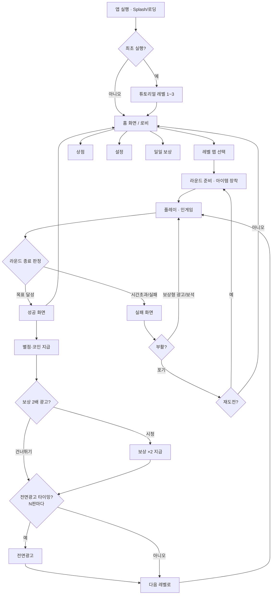
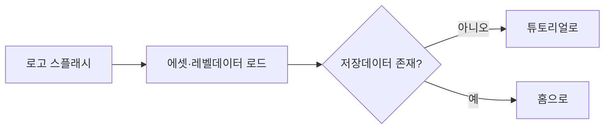
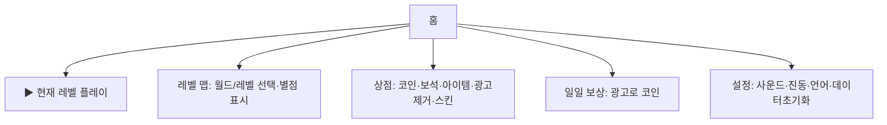
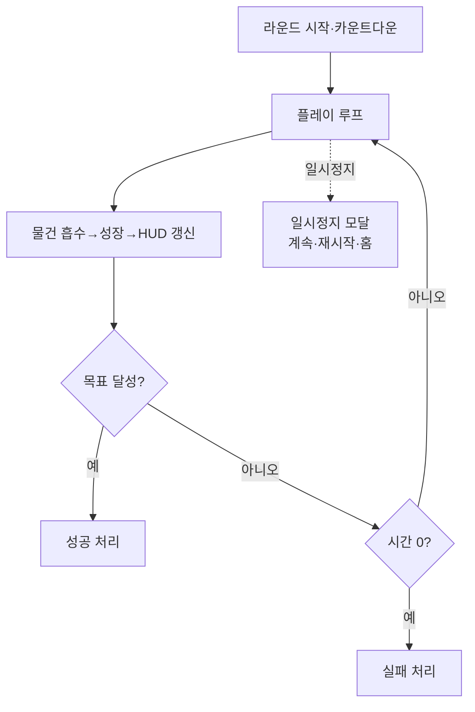
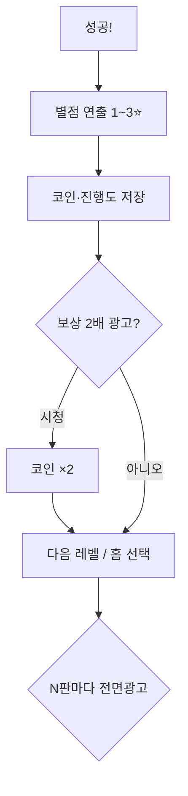
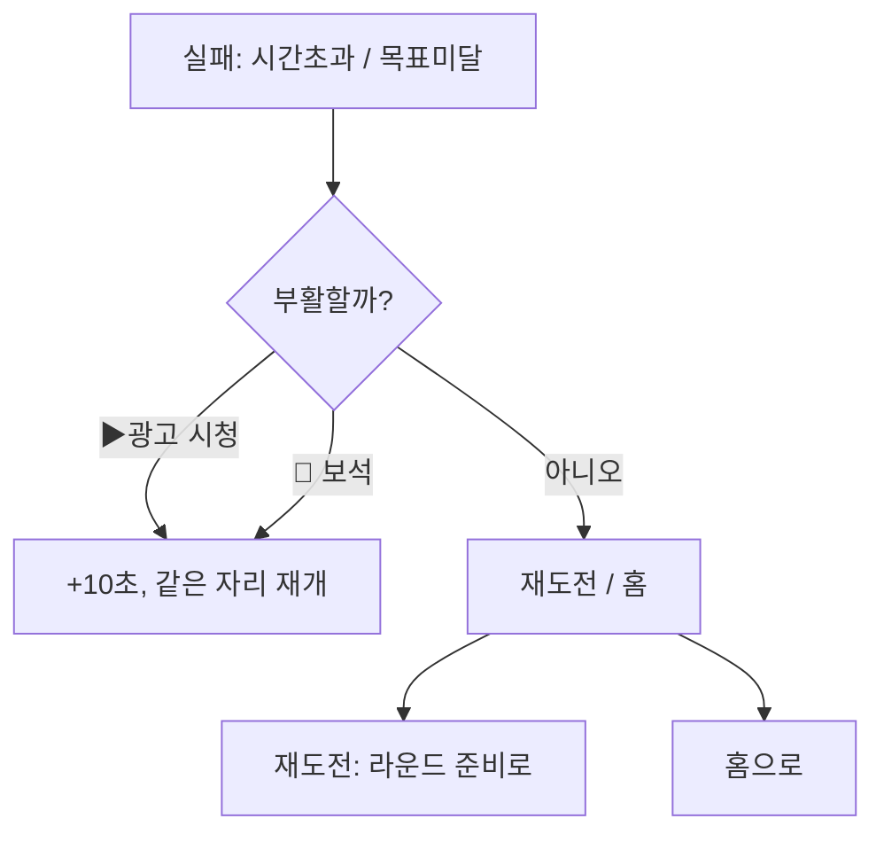
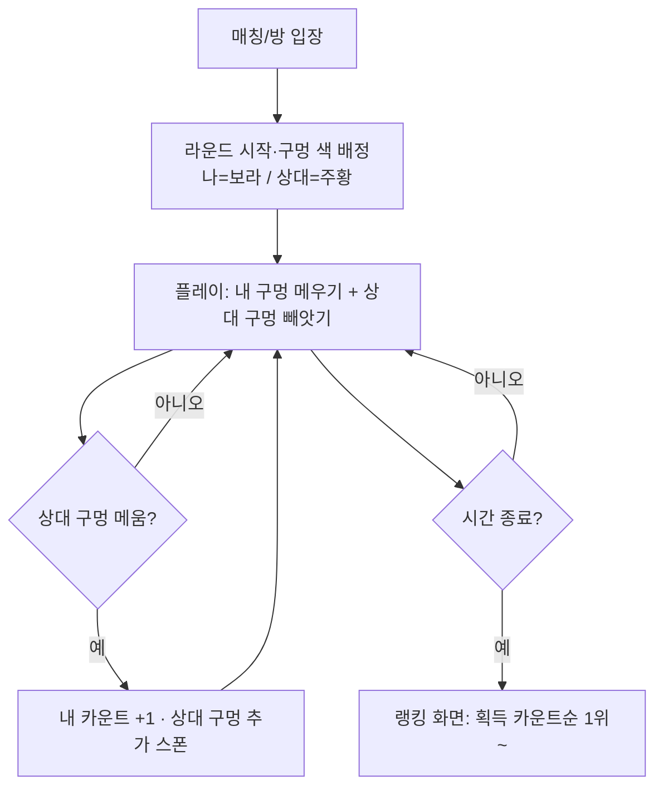

# 굴려라! — 데굴데굴 별왕자 · 개발 계획서 (기획서)

> 장르: 캐주얼 3D 홀(Hole) 게임 · 플랫폼: 모바일 웹(우선) → 추후 하이브리드 앱
> 수익 모델: **광고 중심 + 인앱결제(IAP) 보조**
> 콘텐츠 목표: **레벨 1,000개** (1차 출시 = **600개**, 이후 업데이트로 1,000까지 확장)
> 사업: **퍼블리싱(배급) 계약 진행 중**
> 문서 버전: v0.2 (2026-06-19) · 작성 기준: 현재 빌드 `katamari-v7.html`
> 현재 구현: 테마 맵 6종(방·마당·마트·학교·도시·저승), 구멍 메우기/빠짐(보라=안전·검정=위험), 모든 구멍 제거 시 클리어, 몬스터 추격·공격, 공중 폭격(헬기 30초), 체력(HP) 게이지, 일시정지. 다음 확장: **멀티플레이 경쟁 모드(§11)**, **페인트 모드(§12)**.

---

## 0. 한눈에 보기 (Executive Summary)

| 항목 | 내용 |
|---|---|
| 핵심 루프 | 구멍을 굴려 물건을 빨아들여 → 커지고 → 목표 크기/제한시간 달성 → 다음 레벨 |
| 1차 모드 | **구멍 빨아들이기(hole)** 를 메인 진행 모드로 정식화 (나머지 2모드는 보너스/이벤트) |
| 진행 구조 | 20 월드 × 50 레벨 = **1,000 레벨**, 월드별 테마·난이도 곡선 |
| 출시 범위 | **1차 출시 600레벨**(12월드×50) → 이후 업데이트로 1,000 확장 |
| 퍼블리싱 | **퍼블리셔(배급사) 계약 진행 중** — 글로벌 출시·UA·정산 협의 |
| 수익화 | 보상형 광고(부활·보상2배·아이템) + 전면광고(레벨 사이) + IAP(광고제거·코인팩·스타터팩) |
| 아이템 | Hole.io / Going Balls / Hole and Fill 등 벤치마킹: 시간연장·자석·부스트·시작크기업·부활 |
| 우선순위 | **① 기본 게임 완성 → ② 레벨/진행저장 → ③ 메타(홈·상점·재화) → ④ 아이템 → ⑤ 수익화 → ⑥ 1,000레벨 콘텐츠·밸런싱** |

---

## 1. 게임 비전 & 벤치마킹

### 1.1 컨셉
반다이남코 「괴혼(카타마리 다마시)」의 "굴려서 키운다" 손맛 + Hole.io류 모바일 캐주얼의 **짧고 반복적인 레벨·광고 수익 구조**를 결합. 한 판 30초~2분, "한 판만 더" 도파민.

### 1.2 벤치마킹 대상 (인게임 아이템·수익화 레퍼런스)
| 게임 | 배울 점 | 적용 포인트 |
|---|---|---|
| **Hole.io** (Voodoo) | 구멍이 물건 삼키며 성장, 전면광고 빈도, 스킨 IAP | 핵심 흡수 손맛, 스킨 상점 |
| **Going Balls** | 레벨 진행형 + 보상형 광고로 코인·부활, 데일리 | 레벨 맵 진행, 부활 광고 |
| **Hole and Fill / Hole Run** | 시간연장·자석 등 소모성 부스트 아이템 | 인게임 아이템 5종 |
| **Crowd/Voodoo 공통** | 레벨 클리어 후 보상 2배(rewarded), 스타터팩 | 보상 2배·스타터팩 IAP |

### 1.3 "인게임 아이템 사용 유무" 설계 결론
- **기본 플레이는 아이템 없이도 클리어 가능**하도록 밸런싱(아이템=가속/구제 수단, 필수 아님 → 페이투윈 회피).
- 아이템은 **라운드 시작 전 장착(최대 2개)** + **라운드 중 부활(광고/보석)** 두 경로.
- 소모성(코인/광고로 충전) 중심, 영구 업그레이드는 별도(시작 크기·자석 레벨 등).

---

## 2. 핵심 게임플레이 (기본 게임 — 최우선)

### 2.1 코어 루프
```
구멍 이동(드래그/방향키/자이로) → 자기보다 작은 물건 흡수 → 면적 성장 → 더 큰 물건 흡수 가능
→ 목표 크기 도달 OR 제한시간 내 목표 달성 → 성공 / 실패
```

### 2.2 현재 빌드에서 가져갈 것 / 손볼 것
- 가져갈 것: 흡수 성장(`ABSORB_H`), 빨림 애니(`falling`), HUD(크기·시간·목표바), 자이로(수정 완료), 로우폴리 비주얼.
- 정식화/추가:
  - [ ] **레벨 파라미터화**: 목표 크기·제한시간·맵 크기·물건 구성·장애물을 레벨 데이터로 분리.
  - [ ] **별 3개 채점**: 시간/크기/흡수 개수 기준 1~3성.
  - [ ] **장애물·위험 요소**: 너무 큰 물건/구역(밟으면 못 먹음), 움직이는 물건, (선택) 경쟁 NPC 구멍.
  - [ ] **콤보/점수**: 연속 흡수 시 코인 보너스.

### 2.3 조작
- 터치 드래그 / 마우스 / 방향키 / **자이로(https에서만, 회전각 보정 완료)**.

---

## 3. 레벨 시스템 — 1,000 레벨

### 3.1 구조: 월드 × 레벨
- **20 월드 × 50 레벨 = 1,000** (최종 목표).
- **1차 출시 = 600레벨(12월드 × 50)**. 나머지 8월드(400레벨)는 출시 후 시즌 업데이트로 추가 → 초기 분량 확보 + 라이브 운영 여력.
- 월드 = 테마 + 난이도 밴드. 예시 테마:
  `1.동네공원 → 2.주택가 → 3.학교 → 4.시장 → 5.도심 → … → 18.공항 → 19.항구 → 20.우주정거장`
- 월드마다 흡수 대상 스케일 점프(연필→사람→자동차→집→빌딩→…→행성 느낌).

### 3.2 레벨 데이터 모델 (JSON)
```jsonc
{
  "id": 137,
  "world": 3,
  "theme": "school",
  "goalRadius": 3.2,        // 목표 크기(반지름)
  "timeLimit": 75,          // 제한시간(초). 0이면 무제한(크기 도전)
  "mapHalf": 26,            // 맵 반경
  "spawn": {                // 물건 스폰 테이블 (크기대별 개수)
    "tiny": 40, "small": 30, "medium": 18, "large": 8, "huge": 3
  },
  "hazards": ["movingCar", "tooBigZone"],
  "starThresholds": { "1": 60, "2": 45, "3": 32 }, // 클리어 소요시간(초) 기준 별
  "rewardCoins": 25,
  "seed": 13703              // 절차생성 배치 고정용
}
```

### 3.3 1,000개를 현실적으로 만드는 법 (제작 전략)
1. **절차 생성(seed 기반) + 규칙형 난이도 곡선**으로 950개 자동 생성.
   - 난이도 = `f(world, levelInWorld)` → goalRadius·timeLimit·물건밀도·hazard 수를 곡선식으로 산출.
2. **핵심 50개(월드 첫/끝, 10단위 마일스톤)는 수작업 튜닝**(보스/특수 기믹).
3. 레벨 데이터는 `levels.json`(또는 월드별 파일)로 분리 → 게임 코드와 콘텐츠 분리.
4. **밸런싱 검증 자동화**: 헤드리스 시뮬(`preview_eval`)로 각 레벨 "이론상 클리어 가능 시간" 측정 → 불가능/너무 쉬움 레벨 자동 플래그.

### 3.4 진행 저장
- `localStorage`: 클리어한 최고 레벨, 레벨별 별점, 보유 코인/보석/아이템, 광고제거 여부, 설정.
- 키 예: `hole.progress.v1`.

---

## 4. 인게임 아이템 (Hole 게임 벤치마킹)

### 4.1 소모성 아이템 (라운드 시작 전 최대 2개 장착)
| 아이템 | 효과 | 획득 |
|---|---|---|
| ⏱️ 시간 연장 | 시작 시간 +15초 | 코인/광고 |
| 🧲 자석 | 흡수 가능한 물건을 끌어당기는 반경 ↑ (10초) | 코인/광고 |
| ⚡ 스피드 부스트 | 이동속도 +30% (8초) | 코인 |
| 🚀 가속 로켓 | 잠깐 폭발적 직진 돌진(질주). 멀티에선 상대 진영으로 파고들어 구멍 빼앗기 | 코인/광고 |
| 🦘 점프 | 짧게 점프 — 큰(검정) 구멍·위험 지대·상대 방해를 건너뛰어 회피 | 코인/광고 |
| 🟢 시작 크기 업 | 시작 반지름 +20% | 코인 |
| ✨ 코인 2배 | 이번 판 코인 획득 ×2 | 광고/보석 |

### 4.2 라운드 중 구제
- **부활(Continue)**: 실패 시 같은 위치에서 +10초. 1회차 보상형 광고, 2회차+ 보석.

### 4.3 영구 업그레이드 (메타 성장, 코인 소비)
- 기본 시작 크기 Lv, 기본 자석 반경 Lv, 흡수 성장률 Lv, 시작 시간 Lv. (상한 두어 페이투윈 방지)

### 4.4 스킨 (수익/수집)
- 구멍 테두리/이펙트 스킨, 흡수 사운드 팩. IAP 또는 코인.

---

## 5. 수익화 (광고 중심 + IAP 보조)

### 5.1 광고 (메인)
| 유형 | 위치/트리거 | 비고 |
|---|---|---|
| **보상형(Rewarded)** | 부활 / 보상 2배 / 아이템 무료 / 일일 코인 / 자석 30초 | 핵심 수익·유저 자발적 |
| **전면(Interstitial)** | 레벨 클리어·실패 후 **N판마다(예 2~3판)** | 빈도 캡, 첫 5레벨은 노출 X |
| **배너(Banner)** | 홈/로비 하단 (인게임 X) | 선택, 광고제거 IAP로 제거 |

- **광고 빈도 정책**: 신규 유저 온보딩(1~5레벨) 무광고 → 전면 점진 도입. 보상형은 항상 명확한 보상과 함께.

### 5.2 인앱결제 (보조)
| 상품 | 내용 | 형태 |
|---|---|---|
| 🚫 광고 제거 | 전면·배너 제거(보상형은 유지) | 영구 |
| 🪙 코인팩 | 소·중·대 | 소비성 |
| 💎 보석팩 | 부활·고급아이템용 | 소비성 |
| 🎁 스타터팩 | 광고제거+코인+아이템(할인) | 1회 한정 |
| 📅 시즌/배틀패스 | 레벨 진행 보상 트랙 | 기간제 (후기) |

### 5.3 재화 체계
- **코인(soft)**: 레벨 클리어·광고로 흭득 → 아이템·업그레이드.
- **보석(hard)**: IAP·드물게 보상 → 부활·고급아이템·스킨.

### 5.4 웹 빌드에서의 광고
- 웹(github.io) 단계: 광고 SDK 직접 연동은 제약 → **광고 자리/보상 플로우를 "더미 광고(5초 대기 모달)"로 먼저 구현**하고, 추후 앱 래핑(Capacitor/Cordova) 시 AdMob 연동.

---

## 6. 화면 설계 & 플로우차트

### 6.1 마스터 플로우 (게임 진입 → 홈 → 플레이 → 성공/실패)


### 6.2 게임 진입 (Splash / 온보딩)

- 요소: 로고, 로딩바, (웹) Three.js·폰트 프리로드, 권한/약관은 앱 래핑 시.

### 6.3 홈 화면 / 로비
- **구성 요소**
  - 상단: 코인🪙 · 보석💎 · 설정⚙️
  - 중앙: **PLAY(현재 레벨)** 큰 버튼 + 레벨 맵 진입
  - 하단 탭: 🗺️레벨맵 · 🛒상점 · 🎁일일보상 · 🏆랭킹(후기)
  - (광고제거 전) 하단 배너


### 6.4 플레이 (인게임 HUD)
- HUD: 크기, 제한시간(경고 색), 목표 진행바, 흡수 개수, 일시정지⏸, 장착 아이템 버튼(1~2).


### 6.5 성공 시 (Win)

- 요소: "목표 달성! 🎉", 별 3개, 획득 코인, **[보상 2배 ▶광고]**, **[다음 레벨]**, [홈].

### 6.6 실패 시 (Lose)

- 요소: "아쉬워요!", 현재 크기/목표 대비, **[부활 ▶광고]**(1회 무료), **[다시하기]**, [홈].

---

## 7. 개발 로드맵 (단계별 — 기본 게임 우선)

> 원칙: **재미있는 기본 게임 1판이 먼저**. 그 위에 진행·메타·수익화를 얹는다.

### Phase 0 — 기본 게임 정련 ✅(일부 완료)
- [x] 3D 홀 흡수 코어, HUD, 자이로 수정, 웹 게시
- [ ] 단일 "홀 모드"를 진행용 메인으로 정식화, 별 3개 채점, 콤보/코인

### Phase 1 — 레벨 시스템
- [ ] 레벨 데이터 모델(JSON) + 로더, 난이도 곡선식
- [ ] 진행 저장(localStorage), 레벨 맵 UI(월드×레벨, 별점)
- [ ] 절차생성 + 마일스톤 수작업, 헤드리스 클리어가능성 검증

### Phase 2 — 메타 (홈·상점·재화)
- [ ] 홈/로비, 코인·보석 재화, 상점, 일일 보상, 설정

### Phase 3 — 아이템
- [ ] 소모성 5종 + 부활 + 영구 업그레이드 + (선택)스킨

### Phase 4 — 수익화
- [ ] 보상형/전면/배너 플로우(웹은 더미광고 모달), IAP 자리(광고제거·코인팩·스타터팩), 빈도 정책

### Phase 5 — 콘텐츠
- [ ] **1차 600레벨**(12월드) 데이터 생성·밸런싱 패스, 사운드/이펙트 폴리시 → 출시. (이후 1,000까지 시즌 업데이트)

### Phase 6 — 출시·퍼블리싱
- [ ] 앱 래핑(Capacitor) + AdMob/IAP 실연동, 스토어 메타, 성능/QA
- [ ] **퍼블리셔 계약 진행** — 빌드/지표(리텐션·CPI) 전달, 글로벌 배급·UA·정산 조건 협의, 소프트론치(테스트 마켓) → 글로벌 출시

---

## 8. 기술 메모
- 현재: 단일 HTML + Three.js(r128 CDN). 콘텐츠가 커지면 `levels.json` 외부화, 모듈 분리 검토.
- 저장: localStorage(웹) → 앱 단계에서 동기화 고려.
- 검증: `preview` 헤드리스 `eval`로 자동 스모크/밸런싱.
- 게시: GitHub Pages(https) — **모바일 자이로/센서는 https 필수**.

## 9. 리스크 & 대응
| 리스크 | 대응 |
|---|---|
| 1,000레벨 단조로움 | 월드 테마·기믹·보스레벨, 절차생성+수작업 혼합 |
| 페이투윈 불만 | 아이템은 가속/구제, 기본 클리어는 무과금 가능 |
| 웹 광고 SDK 제약 | 더미광고로 플로우 선구현 → 앱 래핑 시 실연동 |
| 성능(부착물/물건 수) | 오브젝트 풀링, 거리 컬링, MAX 캡 |

---

## 10. 다음 액션 (제안)
1. **Phase 0 마무리** — 홀 모드 진행화 + 별 3개 채점 + 레벨 파라미터 분리.
2. 레벨 데이터 모델 확정 → 난이도 곡선식 1차안.
3. 홈/레벨맵 와이어프레임 → 구현.

---

## 11. 멀티플레이 경쟁 모드 (신규 기획)

> 벤치마킹: **「굴려라 왕자님」 / 「괴혼(카타마리 다마시)」** — 둘이 굴려 더 크게·더 많이 차지하는 대전 손맛.

### 11.1 개요
- 같은 맵에서 **제한 시간 내 실시간 경쟁**(1:1 우선, 추후 N인).
- 각 플레이어는 **자기 색의 서로 다른 구멍 세트**를 배정받는다. (예: 나=보라, 상대=주황)
- 맵은 공유하되 "내가 없앨 구멍"과 "상대가 없앨 구멍"이 **서로 다름** → 같은 시간 동안 각자 다른 목표.

### 11.2 빼앗기(스틸) — 핵심 재미
- 내가 **상대 구멍을 메우면(= "먹으면")**:
  - 내 **획득 카운트 +1** (상대 몫을 가로챔).
  - 상대 쪽에 **구멍이 더 생성**된다(페널티 스폰) → 상대 할 일이 늘어남.
- 내 구멍만 메우면 안전하지만, 상대 구멍을 적극적으로 빼앗으면 **점수도 벌고 상대를 방해**하는 공격적 플레이가 가능.
- 리스크: 상대(또는 내) 구멍이 나보다 크면(검정) 빼앗으려다 **내가 빠질 수 있음**. 색 규칙 그대로(보라=내가 큼·안전, 검정=위험).

### 11.3 승패 & 랭킹
- 종료 시 **획득 카운트**(내 구멍 + 빼앗은 상대 구멍 개수)로 순위 결정.
- 인게임 **실시간 점수 바**(나 vs 상대) + 종료 후 **랭킹 화면**(1위~). 시즌/주간 **리더보드**는 후기.

### 11.4 경쟁 특화 아이템
- 🚀 **가속 로켓**: 상대 진영으로 빠르게 돌진 → 구멍 빼앗기 기습.
- 🦘 **점프**: 큰 구멍·상대 방해·위험 지대를 건너뛰어 회피.

### 11.5 플로우


### 11.6 기술 메모 (단계적 구현)
1. **1차: 봇(AI) 대전** — 같은 화면/엔진에서 상대 구멍 세트 + 빼앗기·페널티 스폰 메커니즘을 로컬로 구현·튜닝. 기존 `spawners`(색·메우기·빠짐)와 `__HOLE` 구조 재활용, 구멍에 `owner`(나/상대) 추가.
2. **2차: 실시간 네트워킹** — WebSocket 룸(서버 권위적 구멍 상태 동기화), 위치 보간. 서버 repo는 추후.
3. 색 규칙 확장: 내 소유=보라, 상대 소유=주황(빼앗을 대상), 위험(나보다 큼)=검정 외곽.

---

## 12. 페인트 모드 (신규 기획) — 굴려서 그림 완성하기

> 컨셉: 굴리는 손맛 + **색칠놀이/잉크 점유(스플래툰류)**. 바닥 캔버스를 페인트 볼로 굴러 칠해 그림을 완성한다.

### 12.1 개요
- 바닥이 **캔버스**(목표 그림의 밑그림·외곽선·영역별 지정색이 옅게 표시).
- **페인트 장착**: 시작 전/중 색을 장착하면 볼이 페인트로 코팅 → **볼이 지나간 자리에 색이 칠해짐**(트레일/스탬프).
- 목표: **제한 시간 내 목표 그림을 N%(예 90%) 이상 칠하면 클리어**. 영역별 지정색 일치 시 정확도 보너스.

### 12.2 페인트 메커니즘
- 페인트 **잔량 게이지** 소모 → 맵의 **페인트 통(리필 지점)** 위를 지나면 보충, 색 교체도 리필 지점에서.
- 다중 색: 영역마다 지정색이 있어 **맞는 색으로 칠하면 정답**, 틀린 색은 덧칠/감점.
- 완성도 = 캔버스에서 올바르게 칠해진 비율(%).

### 12.3 물 괴물(방해) — 핵심 갈등
- 물 관련 괴물(물풍선·해파리·먹구름·물대포 등)이 등장해 **페인팅을 방해**:
  - 지나간 자리의 페인트를 **씻어 지움**(원상복구) → 다시 칠해야 함.
  - 볼에 물을 끼얹어 **일정 시간 "젖음" 상태 → 페인트 못 칠함**(마르거나 페인트 통을 거치면 회복).
  - **물웅덩이(젖은 구역)** 에선 페인트가 묻지 않음.
- 대응: 물 괴물을 **굴려 납작(기존 squash)** 시키거나 회피하고, 마르기 전에 빠르게 칠한다. (물 괴물에 다가가 공격받으면 HP/젖음 누적)

### 12.4 승패 & 채점
- **완성도(%) + 색 정확도 + 남은 시간** → 별 1~3개. 미달 시 실패(재도전/부활).

### 12.5 아이템 연계
- 🎨 **페인트 리필**: 잔량 즉시 가득.
- 🛡️ **방수 코팅**: 잠깐 물 면역(젖음·씻김 무시).
- 🖌️ **큰 붓**: 트레일 폭 ↑(넓게 칠함, 단시간).

### 12.6 기술 메모 (구현)
- **캔버스 = 바닥 `CanvasTexture`**: 볼 위치마다 원/스탬프를 색으로 그리고, 목표 영역 마스크와 비교해 **칠해진 픽셀 비율**로 완성도 산출.
- 물 괴물은 해당 영역 스탬프를 **배경색으로 덮어 "지움"**. 젖음 상태는 볼 플래그(`wet` 타이머).
- 기존 맵/몬스터/HP/`__HOLE` 구조 재활용 — 몬스터에 `water` 종류 추가(페인트 제거·젖음 효과), `paint`(잔량)·캔버스 완성도를 상태(state)에 추가해 HUD 게이지로 표시.

---

## 13. 이벤트 미니게임 (신규 기획) — 굴리기 변형 2종

> 「괴혼」의 "굴려서 키운다" 손맛을 테마만 바꿔 재활용. **이벤트 모드**에 카드로 추가.

### 13.1 ⛄ 눈사람 만들기
- **작은 눈덩이**를 굴려, 군데군데 쌓인 눈·눈더미와 **작은 눈으로 된 몬스터/눈사람 인간**을 흡수해 눈덩이를 키운다.
- 눈덩이가 커질수록 더 큰 대상 흡수(눈송이 → 눈뭉치 → 눈몬스터 → 큰 눈더미). **다양한 크기**의 눈 소스 배치.
- **클리어 조건(미션별로 택1 지정)**:
  - (A) **목표 크기의 눈덩이 1개** 완성, 또는
  - (B) **눈덩이 2개(몸통+머리)** 를 만들어 합쳐 **눈사람 완성**.
- 연출: 눈덩이에 눈 결정 디테일, 완성 시 눈·코(당근)·팔(나뭇가지)·모자 붙는 연출. 움직이는 눈몬스터는 흡수/회피 대상.

### 13.2 🪲 쇠똥구리 (똥 굴리기)
- **쇠똥구리(딱정벌레)** 가 되어, 마을에 가득한 **소똥**을 굴려 **하나의 큰 똥덩어리**로 키운다.
- 흩어진 소똥(크기 다양)을 흡수해 똥덩어리 성장 → **목표 크기 도달 시 클리어**.
- (선택) 방해/경쟁: 다른 쇠똥구리가 내 똥을 노림, 새·발 등 장애물 회피.
- 연출: 공(똥덩어리) 뒤에서 **뒷다리로 미는 쇠똥구리**, 똥덩어리 질감/지푸라기.

### 13.3 공통 메모 (구현)
- 둘 다 기존 **굴리기(roll) 엔진 재활용**: 흡수=공 성장, 대상 `size` 태그. 눈사람=「2볼 합체」 또는 「목표 크기」 분기, 쇠똥구리=「단일 목표 크기」.
- **이벤트 모드** 메뉴 카드: 공 굴리기 · 구멍 빨아들이기 · ⛄ 눈사람 · 🪲 쇠똥구리.
- 아이템 호환(스피드·자석 등). 테마 비주얼(눈/마을·똥)만 교체.

*(본 문서는 살아있는 문서. 단계 진행마다 갱신한다.)*
